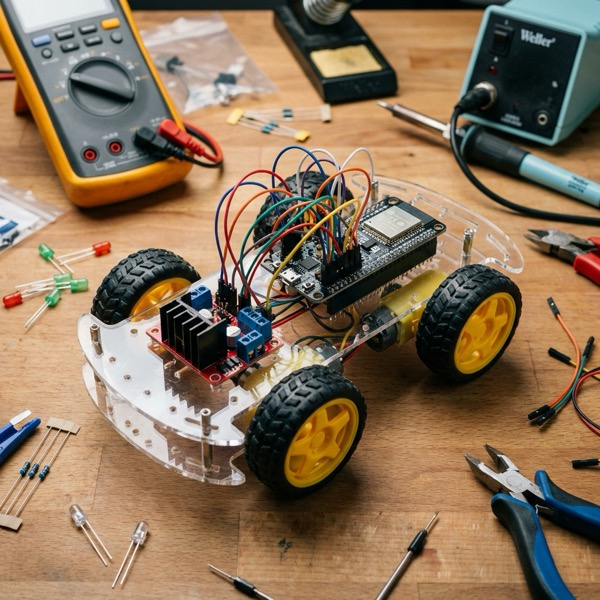
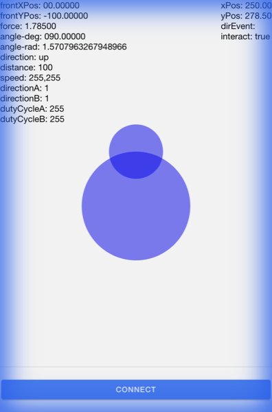

# ESP32 Car Project

<p align="center">
  
</p>

A Wi-Fi-controlled car project using an ESP32 (or ESP8266) as the controller and a cross-platform mobile application built with Ionic and Angular.

## Project Overview

The project consists of two main parts:
1.  **ESP32 Firmware**: An Arduino-based sketch that sets up a WebSocket server to receive control commands and manage motor movements.
2.  **Mobile App**: An Ionic/Angular application featuring a virtual joystick to control the car in real-time.

<p align="center">
  
  <br>
  <em>Joystick in use (Forward command)</em>
</p>

## Features

- **Real-time Control**: Low-latency control via WebSockets.
- **Dynamic Speed**: Joystick distance translates to motor duty cycles (PWM).
- **Dual Motor Support**: Independent control for left and right motor groups (Differential Steering).
- **Access Point Mode**: The ESP32 creates its own Wi-Fi network for direct connection.
- **Visual Feedback**: LED indicators for connection and status.

## Hardware Requirements

- **Microcontroller**: ESP32 (recommended) or ESP8266.
- **Motor Driver**: L298N or similar H-Bridge driver.
- **Motors**: 2x DC Motors.
- **Power Supply**: Battery pack suitable for motors and ESP32 (e.g., 7.4V Li-ion).

## Software Setup

### 1. ESP32 Firmware (`/server/car-server`)
- **Requirements**: Arduino IDE with ESP32 board support.
- **Libraries**:
    - `ESPAsyncWebServer`
    - `AsyncTCP` (for ESP32) or `ESPAsyncTCP` (for ESP8266)
- **Configuration**:
    - Update SSID and Password in `car-server.ino` if using `connectToWifi()`.
    - By default, it starts an Access Point: `MyDevelopmentBoard Car` (Pass: `12345678`).
- **Pins**:
    - Motor A: GPIO 14 (In1), GPIO 12 (In2)
    - Motor B: GPIO 13 (In3), GPIO 15 (In4)
    - LED: GPIO 16

### 2. Mobile App (`/esp32-car/esp32-car`)
- **Requirements**: Node.js, Ionic CLI.
- **Commands**:
    ```bash
    npm install
    ionic serve # To run in browser
    ionic cap add android # To build for Android
    ```
- **Connection**: The app is configured to connect to `ws://192.168.2.184:80/ws`. Update `home.page.ts` if your IP address differs.

## Communication Protocol

The mobile app sends 5-digit string commands over WebSockets:
`[MotorGroup][Direction][DutyCycle]`

- **MotorGroup**: `1` (Right), `2` (Left)
- **Direction**: `0` (Stop), `1` (Forward), `2` (Backward)
- **DutyCycle**: `000` to `255` (PWM value)

Example: `11255` -> Motor A, Forward, Full Speed.

## Project Structure

```text
.
├── esp32-car/            # Ionic Mobile App
│   ├── src/              # App source code
│   └── capacitor.config.ts # Cross-platform config
└── server/
    └── car-server/       # ESP32 Arduino Sketch
        └── car-server.ino
```
